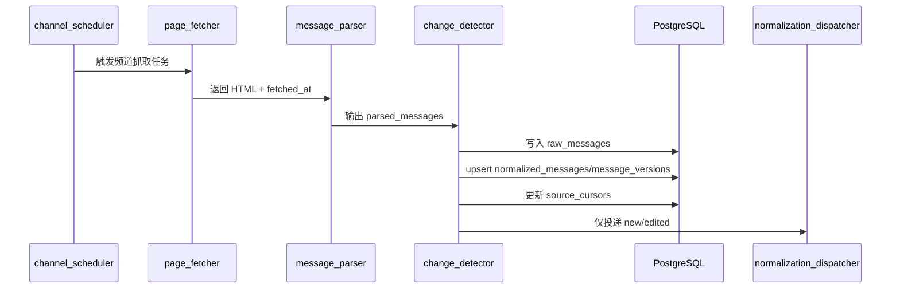

# 03. Telegram 接入与消息处理设计

## 1. 范围与目标

V1 仅实现 Telegram 公开频道网页抓取（`t.me/s/<channel>`），不实现 Bot API 或 TDLib。该模块需要解决四件事：

- 稳定发现新消息与编辑消息
- 对每个频道独立维护进度（cursor）
- 对重复抓取做到幂等，不重复触发后续链路
- 为后续 AI/执行链路提供可追溯、可审计的数据输入

非目标：

- 不在 V1 覆盖受保护频道或私有会话接入
- 不追求一次解析 Telegram 页面全部视觉字段
- 不在本模块引入跨频道上下文与冲突消解

## 2. 设计原则

- 频道隔离：抓取、cursor、去重、错误统计均按频道独立。
- 原始证据优先：`raw_messages` 默认只新增，不覆盖。
- 变化优先驱动：仅 `new` / `edited` 进入后续决策链路。
- 失败可恢复：抓取失败不推进有效 cursor，不污染后续状态。
- 可观测可追溯：每轮抓取都可定位到 `correlation_id`、来源快照和变更结果。

## 3. 组件拆分与职责

| 组件 | 主要职责 | 输入 | 输出 |
| --- | --- | --- | --- |
| `channel_scheduler` | 加载可用频道并按周期调度 | `channel_sources`、运行时配置 | 抓取任务 |
| `page_fetcher` | 拉取频道页面 HTML | 频道来源配置 | 原始页面文本、抓取元信息 |
| `message_parser` | 解析消息块与关键字段 | HTML、解析策略版本 | 结构化来源消息列表 |
| `cursor_manager` | 维护频道抓取进度 | 已解析消息、处理结果 | `source_cursors` 更新 |
| `change_detector` | 判定 `new/edited/unchanged` | 解析结果、现存消息版本 | 变更判定结果 |
| `normalization_dispatcher` | 投递有效变化到标准化处理 | 变更结果 | 标准化输入事件 |

说明：上面是逻辑组件，V1 可在同一进程内实现，不要求独立服务。

## 4. 运行时主流程

一个抓取任务必须在同一频道范围内按顺序完成：抓取 -> 解析 -> 判定 -> 落库 -> 投递。

## 5. 数据契约（V1 最小字段）

### 5.1 `source_cursors`

最小字段建议：

- `channel_source_id`（唯一）
- `last_seen_source_message_id`（最近在页面看到的最大消息号）
- `last_processed_source_message_id`（最近成功进入标准化链路的消息号）
- `last_fetched_at`、`last_success_at`
- `last_error_at`、`last_error_code`、`last_error_message`
- `consecutive_failures`

语义约束：

- `last_seen_*` 可在抓取成功后推进。
- `last_processed_*` 仅在消息写库 + 变更判定成功后推进。
- 抓取失败或解析失败不能推进 `last_processed_*`。

### 5.2 `raw_messages`

最小字段建议：

- `channel_id`、`channel_source_id`、`source_type`
- `source_message_id`
- `raw_content`
- `content_hash`
- `fetched_at`
- `detected_change_type`（`new`/`edited`/`unchanged`/`parse_error`）
- `raw_payload_ref`（原始 HTML 快照引用或等效标识）
- `parser_version`
- `correlation_id`

语义约束：

- 原始记录默认只新增，不覆盖。
- 即使标准化失败，也要保留 `raw_messages` 记录（`parse_error`）。

### 5.3 `normalized_messages`

最小字段建议：

- `channel_id`、`source_type`、`source_message_id`
- `current_version_no`
- `current_content`
- `visible_at`
- `message_status`（`new`/`edited`/`unchanged`/`invalid`）
- `ready_for_decision`（布尔）
- `latest_raw_message_id`
- `correlation_id`

语义约束：

- 同一来源消息在内部应有稳定唯一归属。
- 能从标准化消息回溯到最近原始记录。

### 5.4 `message_versions`

最小字段建议：

- `normalized_message_id`
- `version_no`（递增）
- `content`
- `content_hash`
- `source_edit_token`（可空）
- `diff_summary`（可选）
- `created_at`

语义约束：

- 同一消息版本号必须严格递增。
- 相同 `content_hash` 不应重复创建新版本。

## 6. 调度与轮询策略

### 6.1 默认参数（V1）

- 基础轮询周期：`30s`
- 频道级随机抖动：`0~3s`
- 每轮超时：连接超时 `3s`，读取超时 `10s`（可配置）
- 单轮失败重试：最多 `2` 次（仅网络类错误）

### 6.2 并发与互斥

- 同一频道同一时刻最多一个抓取任务执行。
- 使用频道级互斥锁（例如 Redis key：`intake:lock:<channel_source_id>`）控制并发。
- 锁超时应略大于单轮抓取上限，避免死锁。

### 6.3 失败退避

- 单频道失败采用指数退避（例如 `30s -> 60s -> 120s -> 300s` 上限）。
- 成功一次后重置该频道失败计数。
- 频道 A 失败不影响频道 B 调度。

### 6.4 频道热更新

- 调度器需周期性重载启用频道配置。
- 新增/编辑/停用频道后无需重启服务即可生效。

## 7. 页面抓取与解析策略

### 7.1 抓取策略

- 仅抓取公开页面，默认 `GET https://t.me/s/<channel>`。
- 每轮抓取记录：开始时间、结束时间、HTTP 状态、耗时、结果。
- 建议保留轻量 HTML 快照引用（用于排障和回放）。

### 7.2 解析目标字段

V1 优先解析以下字段：

- `source_message_id`
- `raw_content`（正文文本）
- `visible_at`（来源可见时间）
- `source_edit_token`（若可提取）
- `attachments_summary`（可选）

### 7.3 解析健壮性要求

- 页面结构微调时应尽量降级解析而非全量失败。
- 若关键信息缺失，记录 `parse_error` 并保留原始快照引用。
- 解析结果必须按消息时间/编号稳定排序，避免版本判定抖动。

## 8. 变更判定与版本管理

### 8.1 判定规则

- `new`：本地不存在该 `source_message_id`
- `edited`：已存在且关键可比内容哈希变化
- `unchanged`：已存在且关键可比内容无变化

### 8.2 推荐判定键

- 主键：`channel_id + source_type + source_message_id`
- 版本比较：`content_hash`（基于标准化后的可比文本）

### 8.3 落库事务边界

针对单条消息，建议在一个事务内完成：

- `raw_messages` 新增
- `normalized_messages` upsert
- `message_versions` 新增（仅 `new/edited`）
- cursor 推进（仅成功路径）

`unchanged` 只记录原始抓取与状态，不进入决策投递。

## 9. cursor 策略与重启恢复

### 9.1 双进度设计

为避免“看到但未处理”造成数据丢失，cursor 采用双进度：

- `last_seen_source_message_id`
- `last_processed_source_message_id`

### 9.2 启动恢复

- 进程启动后按 `source_cursors` 恢复调度状态。
- 若频道首次接入无 cursor，默认执行“建立基线”策略：
  - 记录当前页面最近消息为 `last_seen_*`
  - 不回放历史消息到决策链路（可通过配置开启回填）

### 9.3 回填策略（可选）

- 默认：`bootstrap_mode=seed_cursor_only`
- 可选：`bootstrap_mode=backfill_latest_n`（用于联调或专项验证）

## 10. 错误处理与分类

### 10.1 可重试错误

- 网络超时
- 临时 DNS / 连接异常
- 页面瞬时不可达（5xx/网关错误）

处理策略：按单频道重试与退避，不推进 `last_processed_*`。

### 10.2 需人工关注错误

- 页面结构变化导致关键字段长期解析失败
- 长时间零增量但页面可访问（疑似解析规则漂移）
- 消息字段持续异常缺失

处理策略：写入系统日志并标记频道健康状态，提示人工介入。

## 11. 输出契约（对标准化模块）

抓取模块向标准化模块输出最小对象：

- `channel_id`
- `source_type`（V1 固定为 `telegram_web`）
- `source_message_id`
- `raw_content`
- `visible_at`
- `fetched_at`
- `detected_change_type`
- `raw_payload_ref`
- `correlation_id`

只有 `detected_change_type in (new, edited)` 的对象应进入后续 AI 决策链路。

## 12. 可观测性与审计要求

### 12.1 指标建议

- `tg_intake_fetch_total{channel_id,result}`
- `tg_intake_fetch_duration_seconds{channel_id}`
- `tg_intake_parse_messages_total{channel_id}`
- `tg_intake_change_detect_total{channel_id,change_type}`
- `tg_intake_consecutive_failures{channel_id}`

### 12.2 日志字段建议

- `channel_id`、`channel_source_id`
- `correlation_id`
- `source_message_id`（可空）
- `change_type`
- `error_code`、`error_message`
- `retry_count`

### 12.3 脱敏要求

- 不在普通日志中输出完整敏感配置。
- 必要时对消息正文做长度截断，避免日志膨胀和泄露风险。

## 13. 开发切片与验收准入（对应 Phase 3）

### 13.1 Phase 3.1（频道采集能力）

完成标准：

- 支持默认 `30s` 轮询
- 每频道 cursor 独立维护
- 新增/停用频道热更新，无需重启
- 单频道失败不阻塞其他频道

### 13.2 Phase 3.2（消息处理能力）

完成标准：

- `raw_messages`、`normalized_messages`、`message_versions` 正确落库
- 可识别编辑消息并递增版本
- 重复抓取不重复触发决策

### 13.3 与测试清单对齐

交付前至少覆盖以下测试：

- `docs/project-phase-test-checklist.md` 中 Phase 3.1 全部条目
- `docs/project-phase-test-checklist.md` 中 Phase 3.2 全部条目

## 14. 后续扩展位

尽管 V1 不做官方接入，实现时应保留来源适配层接口，例如：

- `fetch_messages()`
- `parse_messages()`
- `build_cursor()`

后续接入 Bot API 或 TDLib 时，应复用“变更判定 + 版本管理 + 标准化投递”主链路，不重写领域逻辑。
