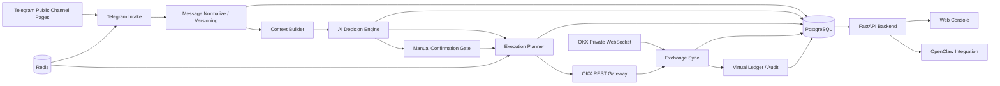

# 自动交易系统技术设计总览（V1）

## 1. 文档定位

本目录用于承接 V1 的技术设计文档。设计文档的作用不是重复需求文档，而是把“需求要什么”落成“系统准备怎么做”。

本轮采用“总文档 + 分块子文档”的拆分方式：

- 总文档负责讲清整体架构、核心技术路线、模块边界和文档地图。
- 子文档分别负责讲清某一块的内部设计、关键数据流、接口边界和实现约束。
- 后续若某一块设计继续细化，应优先在对应子文档扩写，而不是把所有细节重新堆回总文档。

## 2. 设计输入

本技术设计以以下文档为输入：

- [项目说明文档](../project-spec.md)
- [V1 需求文档](../requirements-v1.md)

当前技术设计严格遵循以下已确认边界：

- 单用户、个人自用系统
- V1 仅支持 Telegram 网页抓取
- V1 仅支持 OKX
- V1 仅支持合约 / 永续
- 单账户、单向持仓、逐仓模式
- 新开仓低置信度进入人工确认
- AI 上下文窗口默认推荐值为同频道最近 `8` 条相关消息，可调
- 实施顺序前端优先，先定 Web 控制台视觉和信息架构

## 3. 拆分原则

本次拆分按“跨模块依赖最少、领域边界最清楚、后续最可能独立迭代”的原则组织：

1. 总文档只保留全局视角。
2. 架构、数据、接入、AI、执行、账本、前端、OpenClaw、部署运维分别单独成文。
3. 子文档中允许引用其他子文档，但不复制整段设计。
4. 涉及共享规则的内容，优先沉淀在总文档或数据文档中。

## 4. 总体设计结论

V1 推荐采用“模块化单体 + 后台任务 + 外部网关”的技术路线：

- 前端：`React + Vite`
- 后端：`FastAPI`
- 主数据库：`PostgreSQL`
- 缓存 / 锁 / 任务协调：`Redis`
- Telegram 接入：网页抓取
- OKX 接入：自建 `REST + WebSocket` 适配层
- AI 调用：结构化 schema 输出
- 实时更新：优先 `SSE`，必要时保留 `WebSocket` 扩展位

V1 不建议一开始做微服务拆分，原因如下：

- 当前是单用户系统，部署复杂度应尽量低。
- 核心难点在交易语义和账本一致性，不在服务拆分本身。
- 模块化单体更适合快速迭代前端、后端和执行逻辑，同时保留后续拆分可能性。

## 5. 系统上下文

## 6. 逻辑模块版图

| 模块 | 主要职责 | 关键输入 | 关键输出 |
| --- | --- | --- | --- |
| Telegram Intake | 频道轮询、抓取、cursor 管理 | 频道配置、抓取参数 | 原始消息、抓取状态 |
| Message Normalize | 标准化、版本识别、去重 | 原始消息 | 标准化消息、消息版本 |
| Context Builder | 单频道上下文组装 | 标准化消息、虚拟状态 | AI 输入快照 |
| AI Decision Engine | 结构化解析、置信度判定 | AI 输入快照 | 决策结果 |
| Manual Confirmation | 新开仓人工确认 | 低置信度新开仓决策 | 确认结果 |
| Execution Planner | 动作拆分、执行计划生成 | 决策结果、风险配置 | OKX 执行计划 |
| OKX Gateway | REST 下单 / 撤单 / 查单 | 执行计划 | 订单请求 / 响应 |
| Exchange Sync | 订单、成交、持仓同步 | OKX WebSocket / REST | 真实状态更新 |
| Virtual Ledger | 频道级虚拟账本和 PnL | 决策、订单、成交 | 虚拟持仓、事件流 |
| Web Console | 配置、查看、确认、运维 | 后端 API / 实时推送 | 用户操作 |
| OpenClaw | 日志、查询、低风险控制 | 后端 API | topic 输出 / 控制动作 |

## 7. 关键全局设计原则

### 7.1 单用户前提

- 不设计多用户、多角色、权限矩阵。
- 仍需区分系统自动动作与人工动作，并保留审计记录。

### 7.2 环境隔离

- 模拟盘与实盘配置必须隔离。
- 订单、成交、快照、日志都应带环境标识。

### 7.3 真实状态与虚拟状态分层

- 交易所真实状态永远以 OKX 回报为准。
- 频道虚拟子仓位用于解释和管理频道级生命周期，不直接覆盖真实状态。

### 7.4 幂等与可恢复

- 消息处理、确认执行、下单请求、状态同步都必须具备幂等策略。
- 重启后系统必须能从数据库和交易所恢复关键状态。

### 7.5 关联 ID 贯穿主链路

- 原始消息、标准化消息、决策、确认、订单、成交、账本和日志应能通过 `correlation_id` 串联。

## 8. 文档地图

- [01-system-architecture.md](./01-system-architecture.md)：总体架构、模块边界、运行时拓扑
- [02-data-and-state.md](./02-data-and-state.md)：数据库、Redis、状态模型、唯一键和回放策略
- [03-telegram-intake.md](./03-telegram-intake.md)：抓取、解析、版本识别、cursor 和错误处理
- [04-ai-decision.md](./04-ai-decision.md)：上下文构建、模型调用、结构化输出、确认门控
- [05-okx-execution.md](./05-okx-execution.md)：执行规划、订单模型、OKX 网关、状态同步
- [06-virtual-ledger-and-risk.md](./06-virtual-ledger-and-risk.md)：虚拟子仓位、PnL、风险与对账
- [07-web-console.md](./07-web-console.md)：Web 控制台父文档，说明前端优先原则、总体边界和子文档导航
- [web-console/01-information-architecture.md](./web-console/01-information-architecture.md)：导航结构、全局布局、路由树与响应式策略
- [web-console/02-page-specs.md](./web-console/02-page-specs.md)：各页面职责、区块拆分、主路径和状态要求
- [web-console/03-visual-system.md](./web-console/03-visual-system.md)：视觉方向、设计 token、组件气质与动效原则
- [web-console/04-api-contract-draft.md](./web-console/04-api-contract-draft.md)：前端优先阶段的 API 与 SSE 契约草案
- [web-console/05-frontend-implementation-notes.md](./web-console/05-frontend-implementation-notes.md)：已落地代码结构、mock 策略和后续接入说明
- [08-openclaw-and-ops.md](./08-openclaw-and-ops.md)：OpenClaw 能力边界、topic、skill、操作约束
- [09-deployment-and-observability.md](./09-deployment-and-observability.md)：部署、配置、日志、监控、恢复

## 9. 实施顺序说明

当前技术设计与需求文档保持一致，采用“前端优先”的实施顺序：

1. 先确定 Web 控制台视觉和信息架构。
2. 再补后端骨架和基础 API，让前端尽快接真数据。
3. 然后打通 Telegram、AI、OKX 模拟盘、账本等核心链路。
4. 最后补 OpenClaw 与上线前强化能力。

总文档先写到这一层，后续细节请进入对应子文档继续补充。
